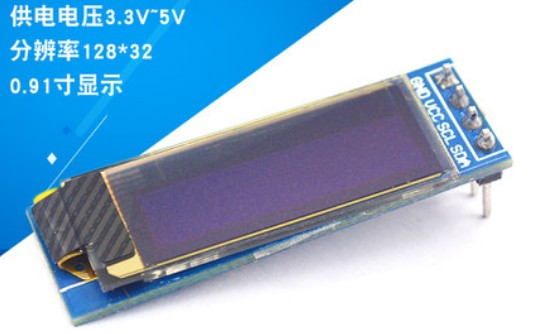

# WG2832 OLED Module
 WG2832 OLED  module driver for TiJOS

| 条目         | 说明                          |
| ---------- | --------------------------- |
| 驱动名称       | 128*32 点阵OLED显示模块           |
| 适用         | 该驱动适用于基于SSD1306驱动芯片的OLED   |
| 通讯方式       | I2C                         |
| Java Class | TiOLED_WG2832.java          |
| 图片         |  |
|            |                             |

